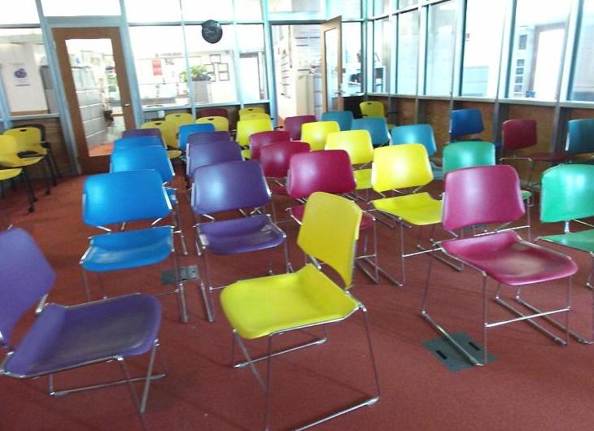
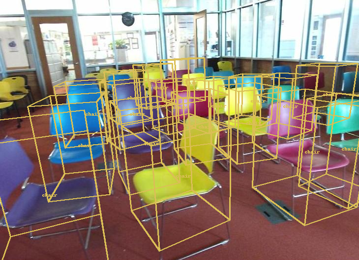
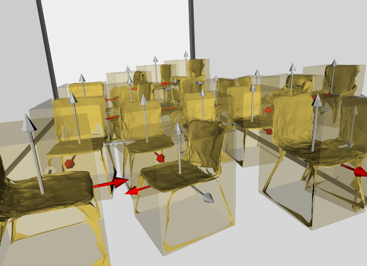
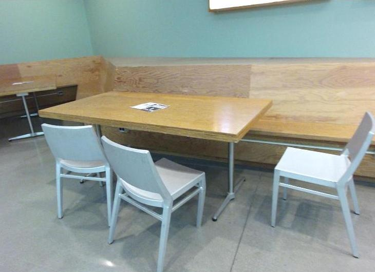
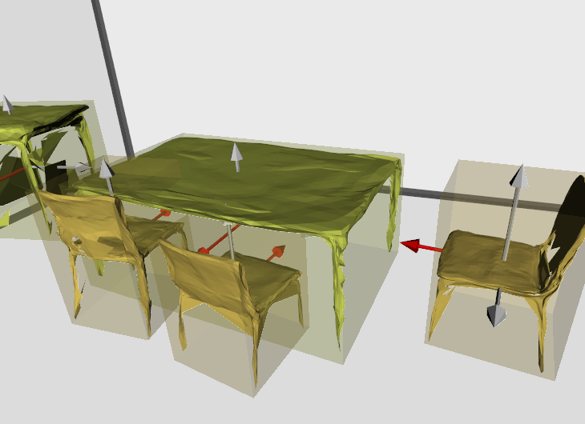

## Single Image 3D Scene Reconstruction Based on ShapeNet Models [[Project Page]](https://github.com/SJTU-CV-2021/Single-Image-3D-Reconstruction-Based-On-ShapeNet)[[Oral Paper]]()

> **Single Image 3D Scene Reconstruction Based on ShapeNet Models**
Xueyang Chen*, Yifan Ren*, Yaoxu Song*
*Zhiyuan College, Shanghai Jiao Tong University, Shanghai 200240, People’s Republic of China


   <br>
  

---

### Install
This implementation uses Python 3.6, [Pytorch1.1.0](http://pytorch.org/), cudatoolkit 9.0. We recommend to use [conda](https://docs.conda.io/en/latest/miniconda.html) to deploy the environment.

* Install with conda:
```
conda env create -f environment.yml
conda activate SIRS
```

* Install with pip:
```
pip install -r requirements.txt
```

---
### Data preparation
In our paper, we use [NYU-v2](https://cs.nyu.edu/~silberman/datasets/nyu_depth_v2.html) to evalue our Layout Estimation Net (LEN) and Object Detection Net (ODN), and use [ShapeNet](https://shapenet.org/) to as our model collection.

#### Preprocess NYU-v2 data

1. Download the raw [NYU-v2 data](https://cs.nyu.edu/~silberman/datasets/nyu_depth_v2.html#raw_parts) to
```
data/nyuv2/dataset/
```
We recomand you to download the Misc part of the whold dataset. Then unzip all the files in the same directory.

2. Download the class labels of objects in SUN RGB-D images [[link](http://horatio.cs.nyu.edu/mit/silberman/nyu_depth_v2/nyu_depth_v2_labeled.mat)] to 
```
data/nyuv2/dataset/nyu_depth_v2_labeled.mat
```

3. Then, your directory tree should look like this:

```
Single-Image-3D-Reconstruction-Based-On-ShapeNet
├── data
|   ├── nyuv2
|   |   ├── dataset
|   |   |   ├── nyu_depth_v2_labeled.mat
|   |   |   ├── misc_part1.zip
|   |   |   ├── misc_part2.zip
|   |   |   ├── computer_lab_0001
|   |   |   ├── computer_lab_0002
|   |   |   ├── conference_room_0001
|   |   |   ├── ...
```

4. Run below to format the testing data in `data/nyuv2/dataset`.
```
cd data/nyuv2
python format.py
```

5. If everything goes smooth, there will be a new folder generated in `nyuv2`.
```
Single-Image-3D-Reconstruction-Based-On-ShapeNet
├── data
│   ├── nyuv2
│   │   ├── dataset
│   │   ├── format
|   |   |   ├── inputs
|   |   |   │   ├── 1
|   |   |   │   │   ├── cam_K.txt
|   |   |   │   │   ├── detections.json
|   |   |   │   │   ├── img.jpg
|   |   |   │   │   └── labeled.png
|   |   |   │   ├── 2
|   |   |   │   ├── ...
│   │   ├── format.py
```

##### Preprocess ShapeNet data

Download the [ShapeNetCore](https://shapenet.org/download/shapenetcore) to 
```
data/ShapeNetCore/
```
Unzip them and nothing else to do. It will be look like:

```
Single-Image-3D-Reconstruction-Based-On-ShapeNet
├── data
|   ├── ShapeNetCore
|   |   ├── taxonomy.json
|   |   ├── 02691156
|   |   ├── 02691156.csv
|   |   ├── 02691156.zip
|   |   ├── 02747177
|   |   ├── 02747177.csv
|   |   ├── 02747177.zip
|   |   ├── ...
```

---
### Run
We use the [pretrained model](https://livebournemouthac-my.sharepoint.com/personal/ynie_bournemouth_ac_uk/_layouts/15/onedrive.aspx?id=%2Fpersonal%2Fynie%5Fbournemouth%5Fac%5Fuk%2FDocuments%2FTotal3D%2Fpretrained%5Fmodel%2Epth&parent=%2Fpersonal%2Fynie%5Fbournemouth%5Fac%5Fuk%2FDocuments%2FTotal3D) by Total3D, and it should be download in `out/pretrained_models/pretrained_model.pth`. You can run our project directly to get the reconstruction result from the formated data.
```
python main.py configs/total3d.yaml --demo_path data/nyuv2/format/inputs/1
```
The result will be saved in `data/nyuv2/format/outputs/1`. Try other formated data as you want!

### Visualize

Do to the speed of our matching process, we split out the visualization independently.

```
python visualize.py configs/total3d.yaml --demo_path data/nyuv2/format/inputs/1
```
---