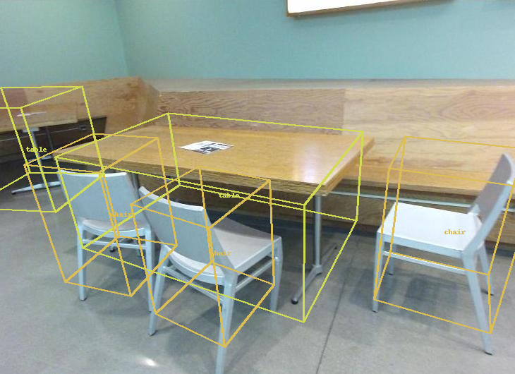

## Single Image 3D Scene Reconstruction Based on ShapeNet Models [[Project Page]](https://github.com/SJTU-CV-2021/Single-Image-3D-Reconstruction-Based-On-ShapeNet)[[Oral Paper]]()

> **Single Image 3D Scene Reconstruction Based on ShapeNet Models**
Xueyang Chen*, Yifan Ren*, Yaoxu Song*
*Zhiyuan College, Shanghai Jiao Tong University, Shanghai 200240, People’s Republic of China


   <br>
  

---

### Install
This implementation uses Python 3.6, [Pytorch1.1.0](http://pytorch.org/), cudatoolkit 9.0. We recommend to use [conda](https://docs.conda.io/en/latest/miniconda.html) to deploy the environment.

* Install with conda:
```
conda env create -f environment.yml
conda activate Total3D
```

* Install with pip:
```
pip install -r requirements.txt
```

---

### Demo
The pretrained model can be download [here](https://livebournemouthac-my.sharepoint.com/:u:/g/personal/ynie_bournemouth_ac_uk/EWuyQXemB25Gq5ssOZfFKyQBA7w2URXR3HLvjJiKkChaiA?e=0Zk9n0). We also provide the pretrained Mesh Generation Net [here](https://livebournemouthac-my.sharepoint.com/:u:/g/personal/ynie_bournemouth_ac_uk/EcbwpViMFQNCluHzWF8P5-gBFjVWjlqp9v3aK4BE41M3Gw?e=cX98bJ). Put the pretrained models under
```
out/pretrained_models
```

A demo is illustrated below to see how the method works. [vtk](https://vtk.org/) is used here to visualize the 3D scenes. The outputs will be saved under 'demo/outputs'. You can also play with your toy with this script.
```
cd Total3DUnderstanding
python main.py configs/total3d.yaml --mode demo --demo_path demo/inputs/1
```

---
### Data preparation
In our paper, we use [NYU-v2](https://cs.nyu.edu/~silberman/datasets/nyu_depth_v2.html) to evalue our Layout Estimation Net (LEN) and Object Detection Net (ODN), and use [ShapeNet](https://shapenet.org/) to as our model collection.

#### Preprocess NYU-v2 data

1. Download the raw [NYU-v2 data](https://cs.nyu.edu/~silberman/datasets/nyu_depth_v2.html#raw_parts) to
```
data/nyuv2/dataset/
```
We recomand you to download the Misc part of the whold dataset. Then unzip all the files in the same directory.

2. Download the class labels of objects in SUN RGB-D images [[link](http://horatio.cs.nyu.edu/mit/silberman/nyu_depth_v2/nyu_depth_v2_labeled.mat)] to 
```
data/nyuv2/dataset/nyu_depth_v2_labeled.mat
```

3. Then, your directory tree should look like this:

```
Single-Image-3D-Reconstruction-Based-On-ShapeNet
├── data
    ├── nyuv2
		├── dataset
			├── computer_lab_0001
			├── computer_lab_0002
			├── conference_room_0001
			├── conference_room_0002
			├── dentist_office_0001
			├── dentist_office_0002
			├── dinette_0001
			├── excercise_room_0001
			├── foyer_0001
			├── foyer_0002
			├── home_storage_0001
			├── indoor_balcony_0001
			├── laundry_room_0001
			├── misc_part1.zip
			├── misc_part2.zip
			├── nyu_depth_v2_labeled.mat
			├── patio_0001
			├── printer_room_0001
			└── student_lounge_0001
```

4. Run below to format the testing data in 'data/nyuv2/dataset'.
```
cd data/nyuv2
python format.py
```

5. If everything goes smooth, there will be a new folder generated in `nyuv2`.
```
Single-Image-3D-Reconstruction-Based-On-ShapeNet
├── data
│   ├── nyuv2
│   │   ├── dataset
│   │   ├── format
		│   ├── 1
		│   │   ├── cam_K.txt
		│   │   ├── detections.json
		│   │   ├── img.jpg
		│   │   └── labeled.png
		│   ├── 2
		│   │   ├── cam_K.txt
		│   │   ├── detections.json
		│   │   ├── img.jpg
		│   │   └── labeled.png
		│   ├── ...
│   │   ├── format.py
```

##### Preprocess ShapeNet data
You can either directly download the preprocessed ground-truth data [[link](https://livebournemouthac-my.sharepoint.com/:u:/g/personal/ynie_bournemouth_ac_uk/EWR0YQN_BjBMg6XbgzHcWg4BpNZywXGSMI-1VnnWZ1CFyg?e=TYhUv8)] to (recommended)
```
data/pix3d/train_test_data
```
Each sample contains the object class, 3D points (sampled on meshes), sample id and object image (w.o. mask). Samples in the training set are flipped for augmentation.

or <br>
<br>

1. Download the [Pix3D dataset](http://pix3d.csail.mit.edu/) to 
```
data/pix3d/metadata
```
2. Run below to generate the train/test data into 'data/pix3d/train_test_data'
```
python utils/preprocess_pix3d.py
```

---
### Training and Testing
We use the configuration file (see 'configs/****.yaml') to fully control the training/testing process. There are three subtasks in Total3D (layout estimation, object detection and mesh reconstruction). We first pretrain each task individually followed with joint training.


##### Pretraining
1. Switch the keyword in 'configs/total3d.yaml' between ('layout_estimation', 'object_detection') as below to pretrain the two tasks individually.
```
train:
  phase: 'layout_estimation' # or 'object_detection'

python main.py configs/total3d.yaml --mode train
```
The two pretrained models can be correspondingly found at 
```
out/total3d/a_folder_named_with_script_time/model_best.pth
```

2. Train the Mesh Generation Net by:
```
python main.py configs/mgnet.yaml --mode train
```
The pretrained model can be found at
```
out/mesh_gen/a_folder_named_with_script_time/model_best.pth
```

##### Joint training

List the addresses of the three pretrained models in 'configs/total3d.yaml', and modify the phase name to 'joint' as
```
weight: ['folder_to_layout_estimation/model_best.pth', 'folder_to_object_detection/model_best.pth', 'folder_to_mesh_recon/model_best.pth']

train:
  phase: 'joint'
```
Then run below for joint training.
```
python main.py configs/total3d.yaml --mode train
```
The trained model can be found at
```
out/total3d/a_folder_named_with_script_time/model_best.pth
```

##### Testing
Please make sure the weight path is renewed as 
```
weight: ['folder_to_fully_trained_model/model_best.pth']
```
and run
```
python main.py configs/total3d.yaml --mode test
```

This script generates all 3D scenes on the test set of SUN-RGBD under
```
out/total3d/a_folder_named_with_script_time/visualization
```

You can also visualize a 3D scene given the sample id as
```
python utils/visualize.py --result_path out/total3d/a_folder_named_with_script_time/visualization --sequence_id 274
```

##### Differences to the paper
1. We retrained the model with the learning rate decreases to half if there is no gain within five steps, which is much more efficient.
2. We do not provide the Faster RCNN code. Users can train their 2D detector with [[link](https://github.com/facebookresearch/maskrcnn-benchmark)].

---

### Citation
If you find our work is helpful, please cite
```
@InProceedings{Nie_2020_CVPR,
author = {Nie, Yinyu and Han, Xiaoguang and Guo, Shihui and Zheng, Yujian and Chang, Jian and Zhang, Jian Jun},
title = {Total3DUnderstanding: Joint Layout, Object Pose and Mesh Reconstruction for Indoor Scenes From a Single Image},
booktitle = {IEEE/CVF Conference on Computer Vision and Pattern Recognition (CVPR)},
month = {June},
year = {2020}
}
```
Our method partially follows the data processing steps in [this work](https://github.com/thusiyuan/cooperative_scene_parsing). If it is also helpful to you, please cite
```
@inproceedings{huang2018cooperative,
  title={Cooperative Holistic Scene Understanding: Unifying 3D Object, Layout, and Camera Pose Estimation},
  author={Huang, Siyuan and Qi, Siyuan and Xiao, Yinxue and Zhu, Yixin and Wu, Ying Nian and Zhu, Song-Chun},
  booktitle={Advances in Neural Information Processing Systems},
  pages={206--217},
  year={2018}
}	
```


