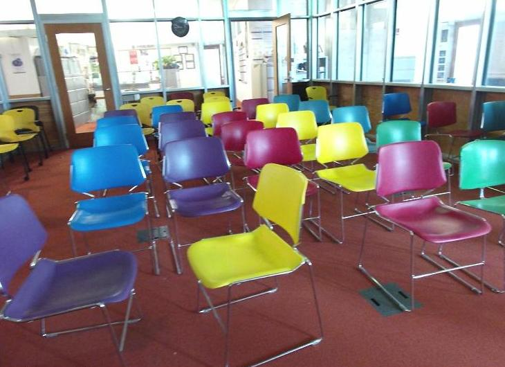

## Single Image 3D Scene Reconstruction Based on ShapeNet Models [[Project Page]](https://github.com/SJTU-CV-2021/Single-Image-3D-Reconstruction-Based-On-ShapeNet)[[Oral Paper]]()

> **Single Image 3D Scene Reconstruction Based on ShapeNet Models**
Xueyang Chen*, Yifan Ren*, Yaoxu Song*
*Zhiyuan College, Shanghai Jiao Tong University, Shanghai 200240, People’s Republic of China


   
<br>
   

---


### Abstract and Method
The 3D scene reconstruction task is the basis for implementing mixed reality, but traditional single-image scene reconstruction algorithms are difficult to generate regularized models. It is believed that this situation is caused by a lack of prior knowledge, so we try to introduce the model collection ShapeNet to solve this problem. Besides, our approach incorporates traditional model generation algorithms. The predicted artificial indoor objects as indicators will match models in ShapeNet. The refined models selected from ShapeNet will then replace the rough ones to produce the final 3D scene. These selected models from the model library will greatly improve the aesthetics of the reconstructed 3D scene. We test our method on the NYU-v2 dataset and achieve pleasing results.


As illustrated in above figure, we propose an end-to-end method given a single image as input and the 3-D reconstruction result from the image as output. The intermediate networks we utilize were first proposed in Total3D. When given a single image with 2D bounding boxes as its input, those networks can construct a roughly 3-D bounding box and mesh for each object. These meshes are then sampled to produce point clouds of the corresponding objects. On the other side of our work, we sample a part of the model in ShapeNet to get their point clouds. Then labels of the objects being matched would serve as indicators of how to split the original point cloud set into smaller sets, each corresponding to a label. Finally, with a refined model in ShapeNet for each object, we can embed the 3-D model of each object into the 3-D scene and complete the reconstruction work.

### Install
This implementation uses Python 3.6, [Pytorch1.1.0](http://pytorch.org/), cudatoolkit 9.0. We recommend to use [conda](https://docs.conda.io/en/latest/miniconda.html) to deploy the environment.

* Install with conda:
```
conda env create -f environment.yml
conda activate Total3D
```

* Install with pip:
```
pip install -r requirements.txt
```

---

### Demo
The pretrained model can be download [here](https://livebournemouthac-my.sharepoint.com/:u:/g/personal/ynie_bournemouth_ac_uk/EWuyQXemB25Gq5ssOZfFKyQBA7w2URXR3HLvjJiKkChaiA?e=0Zk9n0). We also provide the pretrained Mesh Generation Net [here](https://livebournemouthac-my.sharepoint.com/:u:/g/personal/ynie_bournemouth_ac_uk/EcbwpViMFQNCluHzWF8P5-gBFjVWjlqp9v3aK4BE41M3Gw?e=cX98bJ). Put the pretrained models under
```
out/pretrained_models
```

A demo is illustrated below to see how the method works. [vtk](https://vtk.org/) is used here to visualize the 3D scenes. The outputs will be saved under 'demo/outputs'. You can also play with your toy with this script.
```
cd Total3DUnderstanding
python main.py configs/total3d.yaml --mode demo --demo_path demo/inputs/1
```

---
### Data preparation
In our paper, we use [SUN-RGBD](https://rgbd.cs.princeton.edu/) to train our Layout Estimation Net (LEN) and Object Detection Net (ODN), and use [Pix3D](http://pix3d.csail.mit.edu/) to train our Mesh Generation Net (MGN).

##### Preprocess SUN-RGBD data

You can either directly download the processed training/testing data [[link](https://livebournemouthac-my.sharepoint.com/:u:/g/personal/ynie_bournemouth_ac_uk/EcA66Nb1aI1KitzX7avbE10BiHGzovf3rqQebeJHmFB4QA?e=4hE8zv)] to (recommended)
```
data/sunrgbd/sunrgbd_train_test_data
```

or <br>
<br>
1. Download the raw [SUN-RGBD data](https://rgbd.cs.princeton.edu/data/SUNRGBD.zip) to
```
data/sunrgbd/Dataset/SUNRGBD
```
2. Download the 37 class labels of objects in SUN RGB-D images [[link](https://github.com/ankurhanda/sunrgbd-meta-data/blob/master/sunrgbd_train_test_labels.tar.gz)] to 
```
data/sunrgbd/Dataset/SUNRGBD/train_test_labels
```
3. Follow [this work](https://github.com/thusiyuan/cooperative_scene_parsing) to download the preprocessed clean data of SUN RGB-D [[link](https://drive.google.com/open?id=1XeCE87yACXxGisMTPPFb41u_AmQHetBE)] to
```
'data/sunrgbd/Dataset/data_clean'
```
4. Follow [this work](https://github.com/thusiyuan/cooperative_scene_parsing) to download the preprocessed ground-truth of SUN RGB-D [[link](https://drive.google.com/open?id=1QUbq7fRtJtBPkSJbIsZOTwYR5MwtZuiV)], and put the '3dlayout' and 'updated_rtilt' folders respectively to
```
data/sunrgbd/Dataset/3dlayout
data/sunrgbd/Dataset/updated_rtilt
```
5. Run below to generate training and testing data in 'data/sunrgbd/sunrgbd_train_test_data'.
```
python utils/generate_data.py
```
&nbsp;&nbsp; If everything goes smooth, a ground-truth scene will be visualized like


##### Preprocess Pix3D data
You can either directly download the preprocessed ground-truth data [[link](https://livebournemouthac-my.sharepoint.com/:u:/g/personal/ynie_bournemouth_ac_uk/EWR0YQN_BjBMg6XbgzHcWg4BpNZywXGSMI-1VnnWZ1CFyg?e=TYhUv8)] to (recommended)
```
data/pix3d/train_test_data
```
Each sample contains the object class, 3D points (sampled on meshes), sample id and object image (w.o. mask). Samples in the training set are flipped for augmentation.

or <br>
<br>

1. Download the [Pix3D dataset](http://pix3d.csail.mit.edu/) to 
```
data/pix3d/metadata
```
2. Run below to generate the train/test data into 'data/pix3d/train_test_data'
```
python utils/preprocess_pix3d.py
```

---
### Training and Testing
We use the configuration file (see 'configs/****.yaml') to fully control the training/testing process. There are three subtasks in Total3D (layout estimation, object detection and mesh reconstruction). We first pretrain each task individually followed with joint training.


##### Pretraining
1. Switch the keyword in 'configs/total3d.yaml' between ('layout_estimation', 'object_detection') as below to pretrain the two tasks individually.
```
train:
  phase: 'layout_estimation' # or 'object_detection'

python main.py configs/total3d.yaml --mode train
```
The two pretrained models can be correspondingly found at 
```
out/total3d/a_folder_named_with_script_time/model_best.pth
```

2. Train the Mesh Generation Net by:
```
python main.py configs/mgnet.yaml --mode train
```
The pretrained model can be found at
```
out/mesh_gen/a_folder_named_with_script_time/model_best.pth
```

##### Joint training

List the addresses of the three pretrained models in 'configs/total3d.yaml', and modify the phase name to 'joint' as
```
weight: ['folder_to_layout_estimation/model_best.pth', 'folder_to_object_detection/model_best.pth', 'folder_to_mesh_recon/model_best.pth']

train:
  phase: 'joint'
```
Then run below for joint training.
```
python main.py configs/total3d.yaml --mode train
```
The trained model can be found at
```
out/total3d/a_folder_named_with_script_time/model_best.pth
```

##### Testing
Please make sure the weight path is renewed as 
```
weight: ['folder_to_fully_trained_model/model_best.pth']
```
and run
```
python main.py configs/total3d.yaml --mode test
```

This script generates all 3D scenes on the test set of SUN-RGBD under
```
out/total3d/a_folder_named_with_script_time/visualization
```

You can also visualize a 3D scene given the sample id as
```
python utils/visualize.py --result_path out/total3d/a_folder_named_with_script_time/visualization --sequence_id 274
```

##### Differences to the paper
1. We retrained the model with the learning rate decreases to half if there is no gain within five steps, which is much more efficient.
2. We do not provide the Faster RCNN code. Users can train their 2D detector with [[link](https://github.com/facebookresearch/maskrcnn-benchmark)].

---

### Citation
If you find our work is helpful, please cite
```
@InProceedings{Nie_2020_CVPR,
author = {Nie, Yinyu and Han, Xiaoguang and Guo, Shihui and Zheng, Yujian and Chang, Jian and Zhang, Jian Jun},
title = {Total3DUnderstanding: Joint Layout, Object Pose and Mesh Reconstruction for Indoor Scenes From a Single Image},
booktitle = {IEEE/CVF Conference on Computer Vision and Pattern Recognition (CVPR)},
month = {June},
year = {2020}
}
```
Our method partially follows the data processing steps in [this work](https://github.com/thusiyuan/cooperative_scene_parsing). If it is also helpful to you, please cite
```
@inproceedings{huang2018cooperative,
  title={Cooperative Holistic Scene Understanding: Unifying 3D Object, Layout, and Camera Pose Estimation},
  author={Huang, Siyuan and Qi, Siyuan and Xiao, Yinxue and Zhu, Yixin and Wu, Ying Nian and Zhu, Song-Chun},
  booktitle={Advances in Neural Information Processing Systems},
  pages={206--217},
  year={2018}
}	
```


